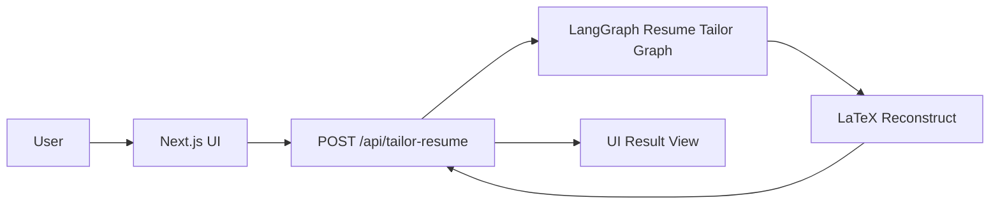
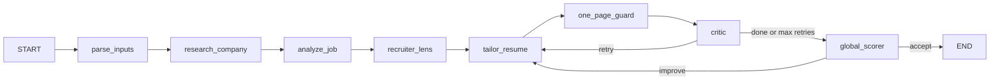
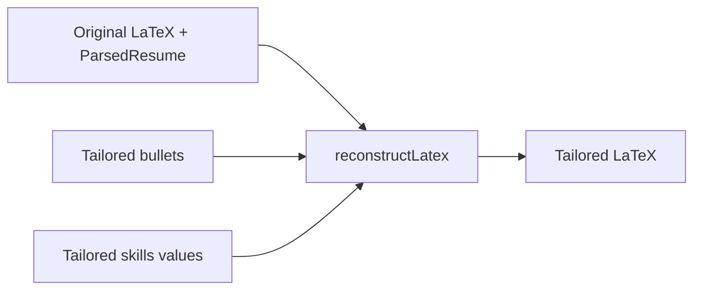

# Resume Tailor

An agentic platform that tailors your LaTeX resume to any job description using LangGraph.js. Paste your resume source, add the job description, and get bullet points and technical skills optimized for the role.

## Features

- **LaTeX in, LaTeX out**: Preserves your exact resume format; only rewrites bullet content
- **Multi-agent pipeline**: Company research, job analysis, recruiter lens, tailor, and critic nodes
- **Smart tailoring**: XYZ format, no buzzwords, line-length optimization, skills reordering
- **Optional Workday URL**: Auto-fill company and job description from Workday job postings
- **Modular backend**: OpenAI by default; swap to other providers via env vars

## Tech Stack

- **Next.js 16** - React framework with App Router
- **TypeScript** - Type safety
- **LangGraph.js** - Multi-node agent orchestration
- **LangChain** - Model abstraction (OpenAI, extensible)
- **Tailwind CSS** - Styling
- **shadcn/ui** - UI components

## Getting Started

### Prerequisites

- Node.js 18+
- npm or yarn
- OpenAI API key (for GPT-4o)
- Serper API key (optional, for company research)

### Installation

1. Clone the repository
2. Install dependencies:

   ```bash
   npm install
   ```

3. Create a `.env.local` file:

   ```bash
   cp .env.local.example .env.local
   ```

4. Add your API keys to `.env.local`:

   ```
   OPENAI_API_KEY=your_openai_api_key_here
   SERPER_API_KEY=your_serper_api_key_here
   ```

   - Get an OpenAI API key [here](https://platform.openai.com/api-keys)
   - Get a Serper API key [here](https://serper.dev/) (for company research)

### Environment Variables

| Variable | Required | Description |
|----------|----------|-------------|
| `OPENAI_API_KEY` | Yes | OpenAI API key for resume tailoring |
| `LLM_PROVIDER` | No | `openai` (default). Future: `anthropic`, `google` |
| `OPENAI_MODEL` | No | Model name (default: `gpt-4o`) |
| `LLM_TEMPERATURE` | No | Temperature for generations (default: `0.2`) |
| `SERPER_API_KEY` | No | For company research. Omit to skip. |
| `DEBUG_TAILOR_RESPONSE` | No | Set to `true` to include debug fields in API response |

### Run Development Server

```bash
npm run dev
```

Open [http://localhost:3000](http://localhost:3000) to see the app.

## How to Use

1. **Paste LaTeX resume**: Paste your LaTeX source (or upload a `.tex` file)
2. **Add job info**: Paste a Workday URL to auto-fill, or enter company name and job description manually
3. **Tailor**: Click "Tailor Resume"
4. **Export**: Copy or download the tailored LaTeX as `resume-tailored.tex`

## Project Structure

```
app/
  page.tsx                     # Main UI (LaTeX input, job form, output)
  api/
    tailor-resume/route.ts     # POST: invokes LangGraph, returns tailored LaTeX
    parse-workday/route.ts     # POST: fetches job data from Workday URL

components/
  latex-resume-input.tsx       # LaTeX textarea + .tex/PDF upload
  workday-url-input.tsx        # Workday URL input
  output-panel.tsx             # Copy/download tailored LaTeX
  ui/                          # shadcn components

lib/
  models/index.ts              # Model getter (OpenAI, modular)
  graph/resume-tailor-graph.ts # LangGraph state, nodes, edges
  latex/parse.ts               # Parse LaTeX → bullets, skills
  latex/reconstruct.ts         # Reconstruct LaTeX from tailored content
  research-company.ts          # Serper-based company research
  workday-parser.ts            # Workday URL parsing
  pdf-parser.ts                # PDF text extraction (for import)
```

## How It Works

At the core of this project is a **LangGraph multi-agent pipeline** that takes your LaTeX resume and a job description and iteratively improves a tailored version.

### High-Level Architecture



- **UI** (`app/page.tsx`): Collects LaTeX resume, job description, and tailoring options.
- **API** (`app/api/tailor-resume/route.ts`): Invokes the LangGraph with the initial state and returns tailored LaTeX.
- **LangGraph** (`lib/graph/resume-tailor-graph.ts`): Multi-agent state machine that performs all analysis and rewriting.
- **LaTeX reconstruct** (`lib/latex/reconstruct.ts`): Safely swaps in tailored bullets and skills while preserving the original document format.

### LangGraph Multi-Agent Pipeline

The main feature is a multi-agent LangGraph called `resumeTailorGraph`:



**Nodes (agents):**

- **`parse_inputs`**: Parses LaTeX into a structured `ParsedResume` (bullet ranges, skills ranges, body bounds).
- **`research_company`**: Optionally enriches context with company research (mission, values, products) if a company name is provided.
- **`analyze_job`**: Turns the job description into structured JSON:
  - `mustHaveKeywords`, `coreResponsibilities`, `niceToHaveKeywords`
  - `senioritySignals`, `domainContext`
  - `roleArchetype` (e.g. `systems_backend_infrastructure`, `fullstack_product`, `frontend`, `ml_data`, `general_swe`)
  - `skillsToPrioritize`, `skillsToDeEmphasize`, `languageToUse`
- **`recruiter_lens`**: Acts as a technical recruiter:
  - Identifies screening signals and red flags.
  - Highlights role-type alignment vs mismatch (e.g. resume reads “frontend/product” but job is “backend/systems”).
  - Suggests which keywords and themes to emphasize.
- **`tailor_resume`**: Main tailoring agent:
  - Rewrites each bullet as a single, grammatically correct sentence (≤ 90 characters).
  - Ensures each bullet, where truthful, explicitly supports at least one `coreResponsibility` or `mustHaveKeyword`.
  - Uses the right **role archetype language** (e.g. automation, reliability, observability, pipelines, testing for backend/infrastructure roles).
  - Reorders and rewrites technical skills values so:
    - `skillsToPrioritize` and must-have tech appear first.
    - `skillsToDeEmphasize` (e.g. React/Next.js for a storage/backend role) are pushed later.
    - Existing skill entries are reworded to surface adjacent tech (e.g. Bash) when strongly implied by the resume.
  - Incorporates feedback from both the critic and global scorer on subsequent passes.
- **`one_page_guard`**: Applies a heuristic to keep bullets short and resume body condensed (one-page friendly).
- **`critic`**: Strict quality gate:
  - Returns `{ done, critique }`.
  - `done = true` only when bullets are:
    - Role-aligned with the job’s archetype.
    - Truthful, concise, single-line, ≤ 90 characters.
    - Not truncated.
    - Grammatically correct.
  - Otherwise, provides critique and loops back to `tailor_resume` up to a maximum number of retries.
- **`global_scorer`**: Global score and improvement driver:
  - Consumes the full context (JD, job analysis JSON, recruiter lens, company research, tailored bullets/skills).
  - Returns `{ score: 0–100, feedback }`.
  - Penalizes:
    - Wrong **role archetype** (e.g. product/frontend tone for a systems/backend role).
    - Missing must-have keywords or responsibilities.
    - Poor skills ordering (job-relevant tech not at the top, irrelevant tech too prominent).
    - Obvious grammar/clarity issues or buzzword stuffing.
  - If `score` is below a threshold and retries remain, sends detailed feedback to `tailor_resume` for another improving pass.

### State and Data Flow

```mermaid
flowchart TD
  State[ResumeState] --> ParsedSection[parsedResume]
  State --> JobDesc[jobDescription]
  State --> CompanyName[companyName]
  State --> JobAnalysis[jobAnalysis (JSON)]
  State --> RecruiterLensState[recruiterLens]
  State --> TailoredBullets[tailoredBullets]
  State --> TailoredSkills[tailoredSkillsValues]
  State --> CritiqueState[critique]
  State --> ScoreState[score]
  State --> ScoreFeedbackState[scoreFeedback]
```

Key values tracked in `ResumeState` (see `lib/graph/resume-tailor-graph.ts`):

- **Inputs**: `latex`, `jobDescription`, `companyName`
- **Parsing**: `parsedResume` (bullet + skills ranges and original text)
- **Analysis & context**: `jobAnalysis`, `recruiterLens`, `companyResearch`
- **Tailoring**: `tailoredBullets`, `tailoredSkillsValues`
- **Quality & scoring**: `critique`, `done`, `tailorRetryCount`, `score`, `scoreFeedback`, `globalRetryCount`

### LaTeX Reconstruction



- `lib/latex/parse.ts`:
  - Locates the document body between `\\begin{document}` and `\\end{document}`.
  - Extracts `\\resumeItem{...}` arguments and technical skills values from the `Technical Skills` section.
- `lib/latex/reconstruct.ts`:
  - Validates that tailored bullets/skills match the original counts.
  - Applies a one-page length heuristic.
  - Escapes LaTeX-special characters.
  - Replaces only the content inside the original bullet and skills ranges, leaving the preamble and postamble untouched.

With `DEBUG_TAILOR_RESPONSE=true`, the API also returns internal fields (`critique`, `jobAnalysis`, `recruiterLens`, `score`, `scoreFeedback`, `globalRetryCount`) so you can debug why a given tailored resume is, for example, a 6.8/10 instead of 8+/10 and iterate on prompts or logic accordingly.

## Model Recommendations

- **Primary**: GPT-4o – Best instruction-following and nuanced rewriting
- **Cost option**: Set `OPENAI_MODEL=gpt-4o-mini` for cheaper runs (lower quality)
- **Future**: Add Anthropic/Google providers in `lib/models/index.ts`

## License

MIT
